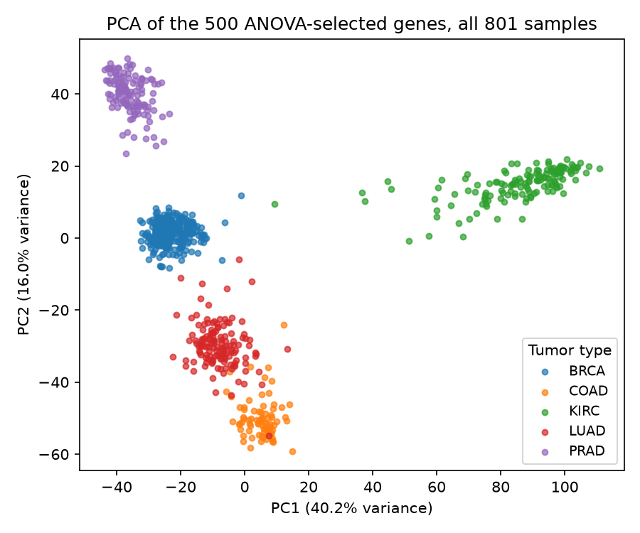
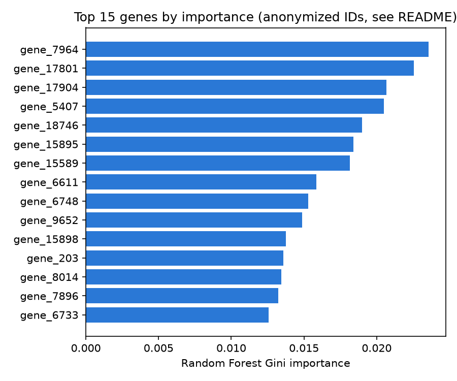

# Biomedical Classification with Machine Learning

A supervised machine learning pipeline for biomedical classification, in two parts. Part 1 benchmarks three classifiers (Logistic Regression, Random Forest, SVM) on the small, tutorial level Wisconsin Breast Cancer dataset. Part 2 deepens the same approach on a real omics dataset: 801 real TCGA tumor samples with 20,531 gene expression features each, classified into 5 cancer types.

> **Key Results:** 98.3% held-out test accuracy on the Wisconsin dataset (Part 1); 99.4% held-out test accuracy classifying 5 real TCGA tumor types from 20,531 gene expression features (Part 2).

> **Disclaimer:** This is an academic portfolio project. Results are for educational and demonstration purposes only and are not intended for clinical use.

---

## Technologies used

Python, pandas, scikit-learn (Logistic Regression, Random Forest, SVM), matplotlib, Jupyter (Part 1); the same stack plus univariate feature selection (`SelectKBest`, ANOVA F-test) for the higher dimensional data in Part 2.

## Biological background

Biomedical classification problems require careful validation: false positives and false negatives both carry real costs. This project demonstrates a reproducible, leakage-free ML workflow, from data loading through model comparison using techniques common in bioinformatics and scientific data engineering roles.

Part 1 (below) uses a 569 sample, 30 feature tutorial dataset with no external download. It is a clean place to demonstrate a leakage-free workflow, but acknowledged here plainly: it is not a hard problem, and it does not look like a real omics dataset. Part 2, further down this README, re-runs the same discipline (no leakage, stratified CV, a held-out test set) on a real, high dimensional omics dataset instead, where the feature count (20,531 genes) vastly exceeds the sample count (801), which is the regime real transcriptomic classification actually lives in.

---

## Part 1: Wisconsin Breast Cancer Benchmark

### Dataset

| Property | Value |
|---|---|
| **Name** | Wisconsin Breast Cancer (Diagnostic) |
| **Source** | `sklearn.datasets.load_breast_cancer` |
| **Samples** | 569 |
| **Features** | 30 numeric cytology measurements |
| **Target** | Binary (0 = malignant, 1 = benign) |
| **Class balance** | 37.3% malignant / 62.7% benign |

Features describe cell nucleus properties (radius, texture, perimeter, area, smoothness, etc.) derived from digitized fine needle aspirate images.

### Repository Structure (Part 1)

```
biomedical-ml-classification/
|
|-- README.md
|-- LICENSE
|-- requirements.txt
|-- .gitignore
|
|-- data/
|   |-- raw/              # Optional: place external CSVs here; tcga_pancan/ for Part 2
|   \-- processed/        # breast_cancer_processed.csv, pancan_example_subset.csv (generated)
|
|-- notebooks/
|   \-- 01_model_development.ipynb
|
|-- src/
|   |-- data_preprocessing.py       # Part 1
|   |-- train_models.py             # Part 1
|   |-- evaluate_models.py          # Part 1
|   |-- pancan_common.py            # Part 2
|   |-- pancan_preprocessing.py     # Part 2
|   |-- pancan_train_models.py      # Part 2
|   \-- pancan_evaluate_models.py   # Part 2
|
|-- results/
|   |-- figures/          # Part 1: confusion matrices, ROC curves, feature importance
|   |-- metrics/          # Part 1: cv_results.csv, test_results.csv
|   \-- pancan/            # Part 2: figures/, tables/, metrics/
|
\-- reports/
    \-- project_summary.md
```

### Methods (Part 1)

1. **Preprocessing** (`src/data_preprocessing.py`): load Breast Cancer Wisconsin dataset from scikit-learn, convert to a pandas DataFrame with a `target` column, check for missing values (none in this dataset), save unscaled features to CSV (no scaling at this stage)
2. **Training** (`src/train_models.py`): 80/20 stratified train/test split (`random_state=42`), 5-fold stratified cross-validation on the training set only, `StandardScaler` inside an sklearn `Pipeline` for Logistic Regression and SVM (fit on training folds only, no leakage), Random Forest trained without scaling (tree based, scale invariant)
3. **Evaluation** (`src/evaluate_models.py`): evaluate all models on the held-out test set; accuracy, precision, recall, F1, ROC/AUC; confusion matrices, ROC comparison, and Random Forest feature importance plots

### Models Tested (Part 1)

| Model | Notes |
|---|---|
| Logistic Regression | Interpretable linear baseline; scaled via Pipeline |
| Random Forest | Ensemble method; provides Gini feature importances |
| SVM (RBF kernel) | Strong on high-dimensional data; scaled via Pipeline |

All models use default or simple hyperparameters (no tuning, see Limitations).

### How to Run (Part 1)

```bash
git clone https://github.com/MohamedElsaid-bit/biomedical-ml-classification.git
cd biomedical-ml-classification
pip install -r requirements.txt

python src/data_preprocessing.py
python src/train_models.py
python src/evaluate_models.py
```

Or explore interactively: `jupyter notebook notebooks/01_model_development.ipynb`

### Example Results (Part 1)

#### Cross-Validation (Training Set, 5-fold)

| Model | CV Accuracy | CV F1 | CV ROC/AUC |
|---|---|---|---|
| Logistic Regression | 0.978 +/- 0.010 | 0.983 +/- 0.008 | 0.996 +/- 0.005 |
| Random Forest | 0.963 +/- 0.018 | 0.970 +/- 0.015 | 0.990 +/- 0.008 |
| SVM | 0.969 +/- 0.015 | 0.976 +/- 0.011 | 0.996 +/- 0.005 |

#### Test Set Performance

| Model | Accuracy | Precision | Recall | F1 | ROC/AUC |
|---|---|---|---|---|---|
| Logistic Regression | 0.983 | 0.983 | 0.983 | 0.983 | 0.995 |
| Random Forest | 0.956 | 0.956 | 0.956 | 0.956 | 0.994 |
| SVM | 0.983 | 0.983 | 0.983 | 0.983 | 0.995 |

Logistic Regression and SVM tied for best test performance. Random Forest was slightly lower but still strong and provides interpretable feature importances.

#### Figures (Part 1)

| File | Description |
|---|---|
| `results/figures/confusion_matrix_*.png` | Per-model confusion matrices |
| `results/figures/roc_curves.png` | Overlaid ROC curves with AUC |
| `results/figures/feature_importance_rf.png` | Top 15 Random Forest features |

### Biological Interpretation (Part 1)

The Random Forest feature importances (`results/figures/feature_importance_rf.png`) rank `worst radius`, `worst perimeter`, and `worst concave points` among the top predictors of malignancy. All three summarize the size and shape of the largest, most irregular nuclei in a sample rather than an average across all cells, which lines up with established cytopathology practice: malignant breast lesions are graded in part on nuclear pleomorphism (enlarged, irregularly shaped nuclei) and on the presence of a worst case subpopulation of atypical cells, not just the mean appearance of a sample. That the model converges on the same features a pathologist is trained to look for is a useful sanity check that it has learned something biologically grounded rather than an artifact of the data, though it is not proof of a causal relationship (see Limitations: Gini importance reflects predictive utility, not biological causality).

This interpretation is read off the model's own output plus general cytopathology background, not from any new wet lab or imaging validation of which specific cells drove the worst case measurements.

### Reproducibility (Part 1)

- **Built-in dataset:** Data comes from `sklearn.datasets.load_breast_cancer`: no external download, API key, or manual file placement required.
- **Runs out of the box:** `pip install -r requirements.txt` followed by the three pipeline scripts is enough to reproduce all results.
- **No data leakage:** `StandardScaler` is never fit on the full dataset. It lives inside sklearn `Pipeline` objects and is fit only on training folds during cross-validation and on the training split for the final model.
- **Pinned dependencies:** Package versions in `requirements.txt` match the environment used to generate the committed example outputs.
- **CI validation:** A GitHub Actions workflow (`.github/workflows/run_pipeline.yml`) runs the full pipeline on every push and pull request using Python 3.11.

### Limitations (Part 1)

- **No hyperparameter tuning.** Models use defaults. `RandomizedSearchCV` would likely improve results.
- **Single built-in dataset.** Performance may not generalize to other cohorts or collection protocols.
- **Feature importance is not causation.** Gini importance reflects predictive utility, not biological causality.
- **No SHAP explainability.** SHAP values would provide more reliable feature attribution.
- **Mild class imbalance.** Weighted metrics are used; SMOTE or class weighting could be explored.
- **Tutorial level dataset.** 569 samples and 30 hand engineered features is not what a real omics classification problem looks like; see Part 2 below.

### Future Improvements (Part 1)

- Add `RandomizedSearchCV` for hyperparameter optimization
- Implement SHAP values for model explainability
- Add SMOTE or class-weight balancing
- Explore XGBoost or LightGBM as additional baselines
- Validate on an independent external cohort

---

## Part 2: Deepening with Real Omics Data (TCGA Pan-Cancer RNA-Seq)

### Why this part exists

Part 1 is a clean demonstration of a leakage-free workflow, but it is not a hard problem (30 hand engineered features, 569 samples, binary) and it is not what a real transcriptomics classification task looks like. Part 2 keeps the same discipline (train/test split, stratified CV, no leakage) but on a real public cancer genomics dataset where the feature count vastly exceeds the sample count, which is the actual regime gene expression classification lives in, and which forces real techniques (univariate feature selection fit on the training fold only, regularized linear models) instead of using 30 pre-engineered features as-is.

### Dataset (Part 2)

| Property | Value |
|---|---|
| **Name** | TCGA Pan-Cancer RNA-Seq (HiSeq) |
| **Source** | [UCI Machine Learning Repository, "gene expression cancer RNA-Seq"](https://archive.ics.uci.edu/dataset/401/gene+expression+cancer+rna+seq), originally from The Cancer Genome Atlas (TCGA) Pan-Cancer project |
| **Samples** | 801 real tumor samples |
| **Features** | 20,531 gene expression values per sample (RNA-Seq, anonymized gene IDs: `gene_0` … `gene_20530`, not mapped to real gene symbols in this public release) |
| **Target** | 5 cancer types by tissue of origin: BRCA (breast, n=300), KIRC (kidney, n=146), LUAD (lung, n=141), PRAD (prostate, n=136), COAD (colon, n=78) |
| **Missing values** | 0 |

This is real RNA-Seq expression data from real tumor samples, not a simulation. The one honest caveat: the gene columns in this specific public release are anonymized IDs, not gene symbols, so this README cannot name the actual biological gene behind any result below, only its anonymized ID. That is a property of this dataset's public release, not something this project did to it.

### Methods (Part 2)

1. **Preprocessing / inspection** (`src/pancan_preprocessing.py`): load the full matrix and labels, confirm 0 missing values, drop the 267 genes with exactly zero variance across all 801 samples (label independent, so safe to do before any split), write a small 15 sample x 30 gene browsable example subset to `data/processed/pancan_example_subset.csv` (too small to reproduce real results, see "How to run it")
2. **Training** (`src/pancan_train_models.py`): 80/20 stratified train/test split (640/161 samples, `random_state=42`); drop the handful of genes that are constant within this particular training fold even though they varied globally (prevents a division by zero in the next step); univariate feature selection with `SelectKBest(f_classif, k=500)` fit on the training fold only, then applied to the test fold (no leakage); `StandardScaler` inside a Pipeline for Logistic Regression and the linear SVM; 5-fold stratified cross-validation on the training set
3. **Evaluation** (`src/pancan_evaluate_models.py`): held-out test set accuracy, macro F1/precision/recall, a 5x5 confusion matrix per model, a 2D PCA projection of the 500 selected genes across all 801 samples (visualization only, not part of the modeling pipeline), and the Random Forest's top 15 genes by Gini importance

### Models Tested (Part 2)

| Model | Notes |
|---|---|
| Logistic Regression | Multinomial, `StandardScaler` in Pipeline |
| Random Forest | 300 trees, unscaled |
| SVM (linear kernel) | Linear kernel chosen deliberately: with 500 features and 640 training samples, a linear decision boundary is the standard choice over RBF |

### How to Run (Part 2)

```bash
# 1. Download the real dataset (about 197 MB, not committed to this repo)
mkdir -p data/raw/tcga_pancan && cd data/raw/tcga_pancan
curl -sSL -o tcga.zip "https://archive.ics.uci.edu/static/public/401/gene+expression+cancer+rna+seq.zip"
unzip tcga.zip && tar xzf TCGA-PANCAN-HiSeq-801x20531.tar.gz
cd ../../..

# 2. Run the pipeline
pip install -r requirements.txt
python src/pancan_preprocessing.py
python src/pancan_train_models.py
python src/pancan_evaluate_models.py
```

Expected runtime: under 15 seconds total on a single CPU core (verified: training 10 seconds, evaluation 4 seconds). Fast because, after feature selection, this is 640 training samples by 500 features, not the full 20,531 gene matrix.

### Results and Interpretation (Part 2)

**Cross-validation (training set, 5-fold):**

| Model | CV Accuracy | CV Macro F1 | CV ROC/AUC (OVR) |
|---|---|---|---|
| Logistic Regression | 0.998 +/- 0.003 | 0.999 +/- 0.003 | 1.000 +/- 0.000 |
| Random Forest | 0.995 +/- 0.004 | 0.996 +/- 0.003 | 1.000 +/- 0.000 |
| SVM (linear) | 0.997 +/- 0.004 | 0.997 +/- 0.003 | 1.000 +/- 0.000 |

**Held-out test set (161 samples):**

| Model | Accuracy | Macro F1 | Macro Precision | Macro Recall |
|---|---|---|---|---|
| Logistic Regression | 0.994 | 0.995 | 0.997 | 0.993 |
| Random Forest | 0.988 | 0.989 | 0.994 | 0.986 |
| SVM (linear) | 0.994 | 0.995 | 0.997 | 0.993 |

Logistic Regression and the linear SVM tied for best (161 of 161 test accuracy would be 1.000; both misclassified exactly 1 sample). Across all three models, the only consistent confusion is a single LUAD (lung) sample called BRCA (breast) by Logistic Regression; every other one of the 161 held-out samples is correctly classified by every model.



**Why accuracy is this high, honestly.** Near perfect accuracy on a 5 class problem can look like a red flag, so here is the actual reason: these 5 labels are 5 different tissues of origin (breast, kidney, lung, prostate, colon), not 5 subtypes of the same cancer. Bulk RNA-seq profiles are dominated by which tissue a tumor came from, so these classes are known in the literature to separate almost linearly, and the PCA plot above shows that directly: the 5 tumor types form visually distinct clusters using just the first 2 principal components (56.2% of variance), before any classifier is even trained. This is a real, correctly measured result, and it is also a genuinely easier task than within cancer type subtyping (for example, molecular subtypes of breast cancer alone) would be. That harder, more clinically realistic framing is listed under Future Improvements.

**Feature importance, with the anonymization caveat stated plainly.** The Random Forest's top gene by Gini importance among the 500 selected is `gene_7964`; the full top 15 is in `results/pancan/tables/feature_importance_rf_top15.csv`. This dataset's public release does not map these IDs to gene symbols, so this README is not naming a biological gene here, unlike the biological interpretation given for Part 1's named cytology features. Mapping these IDs back to gene symbols (the original TCGA/GDC sample manifest would be needed) is listed under Future Improvements.



### Limitations (Part 2)

- **Anonymized gene IDs.** This public release does not include gene symbols, so no specific gene named here can be biologically interpreted without an external ID mapping step that was not done.
- **Task is easier than it looks.** Classifying 5 different tissues of origin is a much easier problem than subtyping within one cancer type; the near perfect accuracy reflects that, not a claim that this approach would work as well on a harder clinical question.
- **Bulk RNA-seq only.** No single cell resolution, so intra-tumor heterogeneity is invisible to this analysis.
- **No external validation cohort.** All 801 samples come from the same TCGA release; performance on a different sequencing batch or a different institution's data is untested.
- **k=500 was not tuned.** The number of ANOVA selected genes was chosen as a reasonable default, not optimized via nested cross-validation.

### Future Improvements (Part 2)

- Map the anonymized `gene_XXXX` IDs back to real gene symbols via the original TCGA/GDC manifest, to make the feature importance results biologically interpretable
- Reframe as a harder, more clinically realistic task: molecular subtyping within one cancer type (for example, BRCA luminal A/B/HER2/basal) instead of tissue of origin
- Nested cross-validation to tune `k` (the number of ANOVA selected genes) instead of a fixed default
- Compare univariate feature selection against an embedded approach (L1 regularized Logistic Regression, or Random Forest importance as the selector)
- Add a GitHub Actions CI workflow for this part, mirroring Part 1's

---

## Skills Demonstrated (Both Parts)

| Category | Tools / Concepts |
|---|---|
| Language | Python 3 |
| Data manipulation | pandas, NumPy |
| Machine learning | scikit-learn (Pipeline, cross-validation, univariate feature selection) |
| Models | Logistic Regression, Random Forest, SVM (RBF and linear kernels) |
| Validation | Stratified 5-fold CV, train/test split, leakage-free feature selection |
| Evaluation | Accuracy, Precision, Recall, F1, ROC/AUC, confusion matrices (binary and 5-class) |
| Dimensionality | High dimensional data (p >> n), ANOVA F-test feature selection, PCA |
| Feature analysis | Random Forest Gini importance |
| Visualization | matplotlib |
| Reproducibility | Fixed random seeds, modular scripts, version-pinned requirements, documented external data download |
| Best practices | No data leakage (scaler and feature selector both fit on train only) |

---

## Contact / links

GitHub: [MohamedElsaid-bit](https://github.com/MohamedElsaid-bit)
Portfolio: [mohamedelsaid-bit.github.io/Portfolio-](https://mohamedelsaid-bit.github.io/Portfolio-/)
